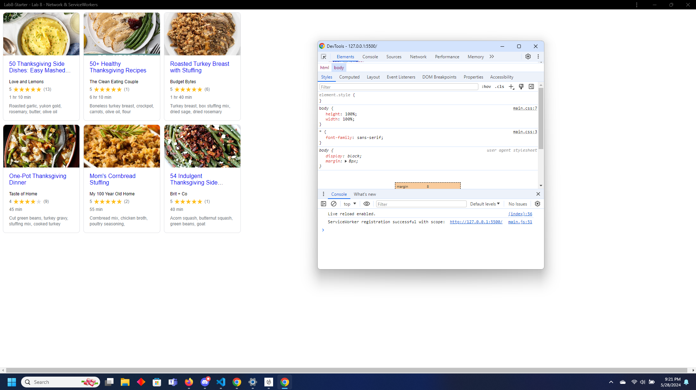

# Lab8-Starter
Members: 
Henry
Brendon
Done on Live Share

Github Pages URL: https://brendon-he.github.io/Lab8-Starter/

Graceful degradation and service workers both try to ensure a web app's functionality remains in tact to ensure a decent user experience even during less than ideal circumstances.
Graceful degradation allows for weaker and older devices to still use an application by removing the unneccesary from the application and leaving the core features, while service workers ensure that an application can allow for a web app to be used even with a weak or nonexistant internet connection. Overall, both are used to enhance the user experience of those who cannot fully utilize a web app's normal processes.
